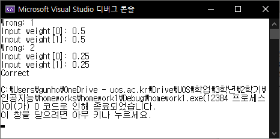

# [2019-2 인공지능] 과제1 결과 보고서

2015920003 컴퓨터과학부 김건호

## 코드 설명

각 함수는 주석으로 간단히 설명되어 있다. 나는 weight와 threshold를 모두 사용자입력에 의해 재설정하지는 않기로 했다. 둘 다 설정하게 된다면 바로 적절한 값으로 지정해버릴 수 있기 때문이다. 하지만, 언제든 weight와 threshold의 재설정방식을 바꿀 수 있도록 필요한 코드는 모두 작성해두었고 주석(103~105줄)으로 처리되어있다. 제출한 코드는 테스트를 통과하지 못할 때마다 weight만 사용자입력으로 재설정한다.

weight와 threshold의 범위는 다음과 같다. (N은 perceptron 입력의 수로, 본 과제에서는 2이다.)

- weight: -1초과 1이하
- threshold: 0초과 $\frac{N}{2}$이하

## 어떤 값을 입력해야 무한 loop에서 빨리 나올 수 있는가?

### 결론

**두 weight의 값을 threshold의 기대값으로 통일하여 설정하는 것이 가장 좋다.**

threshold의 값을 모르는 상황에서 조건을 만족하는 weight 값을 결정해야 loop를 빠져나올 수 있다. 각 테스트마다 틀린 갯수를 바탕으로 threshold를 추측하고, 그 값에 따라 적절한(것으로 추정되는) weight값을 입력한다. 아래는 그 상세내용이다.

### weight와 threshold의 관계

우리가 원하는 `N`차원의 1-layer perceptron의 동작은 AND gate와 같다. `N=2`일때 두 weight의 값을 각각 $a$, $b$라 하고 threshold의 값을 $\theta$라 하면, 다음 조건이 성립해야 한다.
$$
1. \space a \leq \theta
\\
2. \space b \leq \theta
\\
3. \space a + b > \theta
$$
위 조건에서 $a$, $b$는 그 값이 서로 다를 필요가 없다(두 값을 서로 바꾸어도 무방함을 알 수 있다). 두 값이 모두 $c$와 같다 가정하면 위 조건을 아래와 같이 간략화할 수 있다.
$$
c \leq \theta < 2c
$$
$\theta$의 값은 랜덤하다. weight는 위 식을 만족하는 임의의 $c$를 선택하는게 좋을 것이다. 그런데, $c$의 값이 클 수록 $\theta$가 위 조건을 만족할 가능성이 높아지므로, $c$의 값은 클 수록 좋을 것이다. 따라서 나는 $\theta$ 기대값 이하의 가장 큰 값, $\theta$의 기대값을 weight 값으로 택하기로 했다.

> #### 참고
>
> 위 식들에서 등호의 결정은 perceptron의 코드에 따라 달라진다. 내 코드는 perceptron에서 input들에 대한 연산 결과값이 threshold와 같을때 0을 리턴하게 된다.
>
> 위의 식 $c \leq \theta < 2c$ 는 `N=2`일때 적용되는 것으로, 이 식을 일반화하면 $(N-1)c \leq \theta < Nc$ 이다.

### 틀린 갯수로부터 얻을 수 있는 정보

4번의 테스트 과정에서 틀린 갯수는 1개 또는 2개인 것만 고려한다. (0개: 모든 조건을 만족한 것. 4개: threshold가 0 이상이므로 항상 불가.) 두 weight의 값이 같을 때, 틀린 개수가 1개라면 threshold가 weight의 2배 이상이라는 뜻이고, 틀린 개수가 2개라면 threshold가 weight보다 작다는 뜻이다. 이에 따라 threshold의 기대값을 고쳐나갈 수 있으므로 weight값의 재설정에 도움이 된다.

### $\theta$의 기대값에 따른 weight의 재설정과 그 횟수

weight의 재설정은 아래를 따른다. 가능한 weight와 threshold의 범위에 따라 값이 일부 다를 수 있지만, 핵심은 weight의 값을 threshold의 기대값으로 설정한다는 것이다.

- 1번째 재설정: weight = 0.5 ($0.5 \leq \theta < 1$ 일 때 성공)
- 2번째 재설정: weight = 0.25 ($0.25 \leq \theta < 0.5$일 때 성공) 또는 weight = 0.75 ($\theta = 1$ 일 때 성공)
- 3번째 재설정: weight = 0.125 ($0.125 \leq \theta < 0.25$일 때 성공)
- 4번째 재설정: weight = 0.0625 ($0.0625 \leq \theta < 0.125$일 때 성공)
- ...

재설정 횟수의 기대값을 계산하면

$0.999*\sum_{n=1}^{\infty}\frac{n}{2^n} + 0.001*2 = 2$

즉, 올바른 weight를 찾기 위해 평균 **2번**의 weight 재설정이 필요함을 알 수 있다.

> #### 참고
>
> 위 식에서 다음 수들은 코드(rand_float 함수)로부터 기인된다.
>
> - 0.999: $\theta \ne 1$일 확률
>
> - 0.001: $\theta = 1$일 확률
>
> 사실, threshold의 값은 rand_float 함수의 결과에 따라 결정되는 랜덤한 숫자로, 그 경우의 수가 유한개(1000개)이다. 따라서 위 식의 $\sum{}^{\infty}$는 정확하지 않은 계산이다. 하지만 계산상의 편의를 위해 아주 약간의 오차는 허용하기로 했다.

## 실행결과

