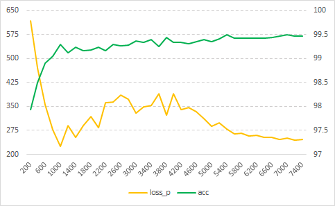
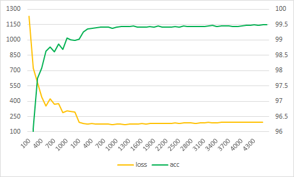
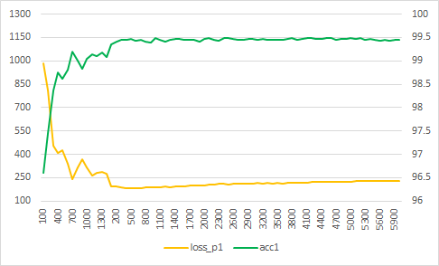
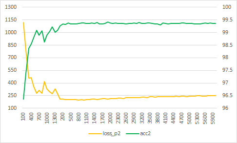
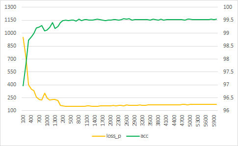
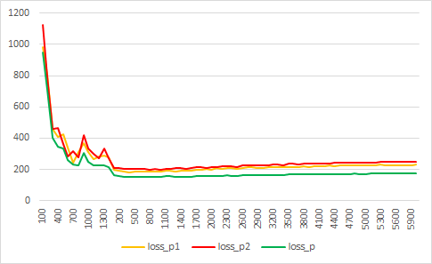
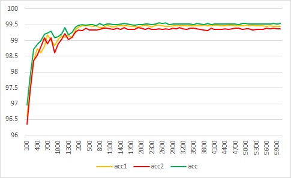

# [2019-2 인공지능] Term Project 결과 보고서

2015920003 컴퓨터과학부 김건호


## 목차

1. [목차](##목차)
2. [개요](##개요)
3. [코드 설명](##코드 설명)
    1. [신경망 구조](###신경망 구조)
    2. [손실, 학습방법, 정확도](###손실, 학습방법, 정확도)
    3. [변수 설정](###변수 설정)
4. [CoLab Setting](##CoLab Setting)
5. [결과](##결과)
6. [기본 구조에서 변경한 것](##기본 구조에서 변경한 것)
7. [마무리](##마무리)


## 개요

본 보고서는 CNN을 이용한 MNIST 데이터 분류 모델의 학습 과정 및 결과를 담고 있다.

프로그램 코드는 별도로 첨부되어 있다. [코드 설명](##코드 설명)에서는 신경망 구조와 학습에 관한 설정을 간단히 나열했다.

본 과제는 [Google Colab](https://colab.research.google.com/)에서 수행했다. [CoLab Setting](##CoLab Setting)에서는 Colab 런타임 관련 설정을 기재했고, [결과](##결과)에서는 신경망 학습의 최종 결과를 간단히 나타냈다.

과제를 수행하는 과정에서 신경망의 구조와 학습방법을 여러 차례 변경했다. 변경과정에 대한 내용은 [기본 구조에서 변경한 것](##기본 구조에서 변경한 것)에서 간단히 소개한다. 그 외 별다른 언급이 없는 한, 아래 기재된 내용은 가장 마지막 변경에서의 신경망 구조 및 학습방법을 바탕으로 한다.


## 코드 설명

### 신경망 구조

- Input Layer
- 1st Convolution Layer
- 1st Pooling Layer
- 2nd Convolution Layer
- 2nd Pooling Layer
- 3rd Convolution Layer
- 3rd Pooling Layer
- 1st Fully Connected Layer
- 1st Dropout Layer
- 2nd Fully Connected Layer
- 2nd Dropout Layer
- Output Layer


### 손실, 학습방법, 정확도

- **Loss**: Cross Entropy and L2 Regularization
- **Training Optimizer**: AdamOptimizer with Dynamic Learning Rate
- **Accuracy**: Average of Correct Ratio


### 변수 설정

#### Neural Network

- **Size of Input Layer**: `784`
- **Size of Fully Connected Layer**: `1024`/`512` (for 1st/2nd layer)
- **Activation Function for Convolution Layers**: `ReLU` (bias: `0.1`)
- **Activation Function for Fully Connected Layers**: `Leaky ReLU` (bias: `0.1`)
- **Activation Function for Output Layer**: `Softmax`
- **Number of Convolutional Filters**: `32`/`64`/`128` (for 1st/2nd/3rd layer)
- **Size of Filters for All Convolution Layers**: `[3, 3]`
- **Kernel Size for All Pooling Layers**: `[2, 2]`
- **Stride for All Pooling Layers**: `[2, 2]`
- **Zero-Padding for All Layers**: `'SAME'`
- **Type of Pooling for All Pooling Layers**: `(Max Pooling + Average Pooling) / 2`
- **Probability of Dropout**: `0.5`/`0` (for training/test)

#### Training Stage 1

- Iteration: `1400`
- Learning Rate: `0.00375 ~ 0.0025`
- Batch Size: `200 ~ 300`
- Loss Coefficient for L2 Regularization: `100 ~ 400`

#### Training Stage 2

- Iteration: `6000`
- Learning Rate: `0.0002 ~ 0.00000001`
- Batch Size: `400 ~ 600`
- Loss Coefficient for L2 Regularization: `100 ~ 0`


## CoLab Setting

| 구분            | 값       |
| --------------- | -------- |
| 런타임 유형     | Python 3 |
| 하드웨어 가속기 | GPU      |


## 결과

똑같은 구조에서도 무작위적 요소에 따라 학습결과가 달라진다. 다음은 몇 번의 시도 중 Test Data에 대한 **accuracy**가 가장 높았던 것과 **loss**가 가장 낮았던 경우다.


| 항목             |  i   | accuracy |  loss  |
| ---------------- | :--: | :------: | :----: |
| minimum loss     | 800  |  99.55%  | 150.57 |
| maximum accuracy | 2500 |  99.56%  | 158.63 |


## 기본 구조에서 변경한 것

### Mix Pooling

Pooling은 Max Pooling과 Average Pooling의 평균을 사용했다. 두 방법이 모두 사용된다는 것은 각각의 장점이 있기 때문이라 생각했다. 이 방법은 계산이 2배로 늘어나는 단점이 있기 때문에 그만큼 이게 효율적인 방법인지 확인해야 한다. 하지만 다른 사항들에 더 관심이 가서 일단 이대로 두었다.


### Loss

손실값 **loss**는 두 손실(**loss_p**, **loss_w**)의 합으로 정의했다.

#### loss_p

**loss_p**는 Cross Entropy를 조금 수정한 것이다. 기존에 Softmax의 결과 $p$에 대해 $log(p)$를 계산하던 것을 $log(p + 0.00000000000000000000001)$로 변경했다. $p$가 underflow 등의 이유로 `0`일 때 $log$ 계산에서 오류(`NaN`)가 발생하기 때문이다.

#### loss_w

**loss_w**는 L2 정규화를 적용하기 위한 것이다. 총 5개의 Layer에 대해, 각 Layer에서 모든 weight의 제곱의 평균을 계산하여 더한 값이다.

#### loss

**loss**는 다음과 같이 정의된다.

```python
loss = loss_p + loss_w * loss_coefficient
```

**loss_coefficient**는 학습 과정에서 동적으로 결정되는 값이다.

**loss_coefficient**가 클 수록 L2 정규화가 강력히 적용되어 학습 과정에서 weight의 outlier가 줄고 전체적으로 weight의 크기가 매우 줄어들었다. 일반적으로 L2 정규화를 강력히 적용할 수록(즉, **loss_coefficient**를 크게 할 수록) 학습과정에서 Test Data에 대한 **loss_p**가 빨리 줄어드는 경향을 보였다. **loss_p**가 `200` 미만까지도 달성 가능함을 확인했고 평균적으로 `400` 이하일 때 좋은 **accuracy**를 기대할 수 있었다. 하지만 **loss_coefficient**를 지나치게 높이면 weight의 크기가 너무 줄어 **loss_p**가 다시 상승했다. 현재의 **loss_coefficient**는 반복적인 테스트를 통해 *적당하다고 여겨지는 값*으로 설정했다.


### Training

신경망의 학습방법은 다음과 같이 변경되어왔다.

1. **learning rate**, **batch size**를 고정하여 학습
2. 학습을 학습횟수에 따라 여러 단계로 나누고, 각 단계에서 **learning rate**, **batch size**를 고정하여 학습
3. **learning rate**, **batch size**, **loss coefficient**를 학습횟수에 따라 계속 변경
4. 학습을 두 단계로 나누고, 각 단계에서 **learning rate**, **batch size**, **loss coefficient**를 학습횟수에 따라 계속 변경
5. 앙상블 학습

학습방법의 변경은 속도 개선, 정답률(**accuracy**) 향상, 오차(**loss_p**) 감소를 목표로 진행했다.


#### 1. learning rate, batch size를 고정하여 학습

가장 처음에 선택한 학습방법으로, **learning rate**와 **batch size** 등의 값을 상수로 고정하고 진행하는 방법이다. 이 경우 정답률이 `99.2% ~ 99.3%` 정도에 머무르는 경우가 많았다. **batch size**가 클수록 정답률이 전반적으로 높았으나 학습시간이 오래 걸렸다. 또한, 이 방법에서 학습을 오래 진행할 수록 overfitting이 발생했고 **loss_p**의 값이 증가했다.


#### 2. 학습을 학습횟수에 따라 여러 단계로 나누고, 각 단계에서 learning rate, batch size를 고정하여 학습

위 **1.**의 방법을 여러 단계로 나누어 진행하는 방법이다. 1단계에서는 학습시간을 단축시키기 위해 **learning rate** 및 **batch size**를 작게 하고, 2단계에서는 크게 설정하여 속도와 성능을 모두 잡으려 했다. 하지만 이 방법 또한 **1.**에서처럼 overfitting이 쉽게 발생했고, 정답률도 `99.4%`를 달성하기 쉽지 않았다.


#### 3. learning rate, batch size, loss coefficient를 학습횟수에 따라 계속 변경

위 **1.**과 **2.**의 방법을 섞은 것이다.

이때부터 나는 위에서 언급한**loss_w**를 정의하여 L2 Regularization (weight decay)을 적용하기 시작했다. 전반적으로 성능은 향상되었지만, 만족스럽지 않았다. 그래서 learning rate decay를 적용하고, **batch size**와 **loss coefficient**또한 학습횟수에 따라 변경되도록 했다. (이후 모든 학습과정에서 **learning rate**, **batch size**, **loss coefficient**는 `50`번 학습마다 갱신된다.)

우선, 학습속도와 성능 모두 만족스러웠다. 초반에는 아주 작은 크기의 batch로 시작하기 때문에 빠른 학습이 가능하고, 이후 overfitting이 일어날만한 상황에서 weight decay, learning rate decay 등에 의해 loss_p가 `200 ~ 300`의 값을 유지하는 경향을 보였다.

[그림1]은 이 학습방법을 적용한 결과다. 총 `7400`회의 학습이 진행되었다. Test Data에 대한 신경망의 성능은 다음과 같다. 이 방법으로 여러 번 반복해도 결과는 비슷했다.


**신경망의 성능**

| 항목             |  i   | accuracy | loss_p |
| ---------------- | :--: | :------: | :----: |
| minimum loss     | 1000 |  99.30%  |  224   |
| maximum accuracy | 7000 |  99.49%  |  250   |


**[그림1]**




이 방법을 적용했을 때 학습 중간에 **loss_p**가 잠시 상승한다가 다시 줄어든다는 것이 아쉬웠다. 그래서 나는 이 구간을 피하거나 빨리 지나가도록 하기 위해 다음 방법을 택했다.


#### 4. 학습을 두 단계로 나누고, 각 단계에서 learning rate, batch size, loss coefficient를 학습횟수에 따라 계속 변경

위 **2.**와 **3.**을 섞은 것이다. **3.**에서처럼 각 변수 값이 학습횟수에 따라 결정되되, 그 정도가 단계에 따라 다르도록 했다. **3.**에서 학습횟수가 약 `1000 ~ 1400`일 때부터 **loss_p**가 증가했기 때문에, 이 방법에서 학습횟수 `1200`을 기준으로 단계를 나누었다. 1단계의 목표는 **accuracy** `99%`를 달성하는 것이고, 2단계의 목표는 **loss_p**를 약 `200`으로 유지한 채 빠르게 **accuracy** `99.45%`를 달성하는 것이다.

[그림2]는 이 학습방법을 적용한 결과다. 1단계 `1200`회, 2단계 `4500`회 학습을 진행했다. Test Data에 대한 성능은 다음과 같다. 테스트를 반복할 때마다 달성하는 최대 **accuracy**는 조금씩 달랐지만 **accuracy**와 **loss_p**를 비교적 안정적으로 개선하는 경향을 보였다.


**신경망의 성능**

| 항목             |  i   | accuracy | loss_p |
| ---------------- | :--: | :------: | :----: |
| minimum loss     | 900  |  99.42%  |  171   |
| maximum accuracy | 4200 |  99.49%  |  191   |


**[그림2]**




**3.**에 비해 **accuracy**가 비약적으로 상승하지는 않았지만 **loss_p**를 매우 낮출 수 있었다. 이제 다시 **accuracy**를 더 올리기 위해 마지막으로 앙상블을 적용하기로 했다.


#### 5. 앙상블 학습

**4.**에서 적용한 모델을 복제하여 두 신경망을 동시에 학습하도록 했다. 그리고 그 둘의 평균으로 숫자이미지를 분류하기로 했다.

[그림3], [그림4]는 독립적으로 학습되는 두 신경망이다. 신경망 각각의 성능은 [그림2]의 모델보다 좋지 않고, **loss_p**가 증가하는 것으로 보아 다소 overfitting되었다고 볼 수 있다. Test Data에 대한 두 신경망의 성능은 다음과 같다.


**신경망 1의 성능**

| 항목             |  i   | accuracy | loss_p |
| ---------------- | :--: | :------: | :----: |
| minimum loss     | 400  |  99.46%  | 182.75 |
| maximum accuracy | 2500 |  99.49%  | 204.81 |


**신경망 2의 성능**

| 항목             |  i   | accuracy | loss_p |
| ---------------- | :--: | :------: | :----: |
| minimum loss     | 800  |  99.36%  | 199.26 |
| maximum accuracy | 1900 |  99.41%  | 210.32 |


**[그림3]**




**[그림4]**




[그림 5]는 위 두 신경망의 출력 평균을 이용하는 앙상블의 **loss_p**와 **accuracy**다. 비록 두 신경망은 [그림2]의 신경망에 비해 성능이 뛰어나지 않았지만 앙상블은 좋은 결과를 보였다. Test Data에 대한 앙상블의 성능은 다음과 같다.


**앙상블의 성능**

| 항목             |  i   | accuracy | loss_p |
| ---------------- | :--: | :------: | :----: |
| minimum loss     | 800  |  99.55%  | 150.57 |
| maximum accuracy | 2500 |  99.56%  | 158.63 |


**[그림5]**




[그림6]은 두 신경망과 앙상블의 **loss_p**를 비교한 것이고 [그림7]은 **accuracy**를 비교한 것이다.


**[그림6]**




**[그림7]**




비록 신경망의 수가 `2`개뿐이지만, 앙상블은 **loss_p**를 낮추고 **accuracy**를 올리는데 매우 효과적이었다. 단일 신경망으로는 `99.5%`의 **accuracy**를 달성하기 매우 힘들었는데, 이 모델로는 매우 쉽게 달성할 수 있었다(여러 번 반복했을 때 `99.47%`는 거의 항상 달성했고 대부분 `99.5%` 이상을 달성했다). 만약 신경망의 수를 훨씬 늘리면 성능이 더 향상되겠지만 그만큼 학습에 더 많은 시간이 필요할 것이다.

> 나는 기말고사 이후 앙상블을 도입하기 시작했다(기말고사 답안지에도 *앙상블을 구현하고 싶다*고만 적어두었다). 그래서 더 많은 수의 신경망을 이용하는 것은 시간 제약상 도전하지 않았다.


## 마무리

나의 신경망은 Test Data에 대해 약 `99.56%`의 정확도를 가진다. **learning rate**, **batch size** 등, 여러 값을 동적으로 변경해나가고 학습을 여러 단계로 나누어 더욱 **accuracy**를 높일 수 있었다. Test Data에 대한 **loss**도 **accuracy** 만큼 중요한데, 앙상블은 **accuracy**를 높이면서 **loss**는 줄이는 결과를 보여 좋은 성능의 모델을 만드는데 아주 효과적이었다.

시간제약 등의 이유로 구현하고 싶었던 모든 것(Data Augmentation, Batch Normalization 등)을 구현하지는 못했다.이것들을 종합적으로 적용하면 더 성능이 좋은 신경망을 만들 수 있을 것으로 기대된다.